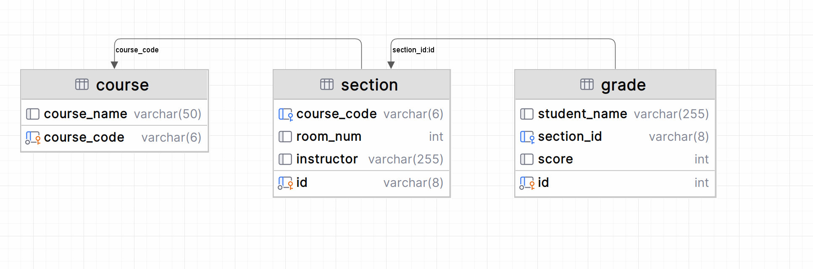

# Hello SQL

## 🛒 SQL Practice Exercise: Design a Simple Online Shop Database

You're building a database for a small online store. Your job is to **create the database**, **design the tables**, **insert the data**, and then **retrieve some basic information** from your tables.

---

### 🧠 Step 1 – Create and use a new database

Choose a name for your database (for example: `online_shop`) and make sure to use it before creating tables.

---

### 📦 Step 2 – Products Table

This table stores information about items for sale.

#### Your table must include:
- A unique product ID (e.g., a number like 101)
- The product name (like "Laptop")
- The product price (decimal number with cents, e.g., 499.99)  
  👉 *Hint: search for how to store decimal numbers in MySQL*
- The available stock (how many are in storage – a whole number)

#### Data to insert:

| Product ID | Product Name | Price   | Stock |
|------------|--------------|---------|-------|
| 101        | Laptop       | 800.00  | 10    |
| 102        | Smartphone   | 500.00  | 20    |
| 103        | Headphones   | 50.00   | 100   |
| 104        | Monitor      | 200.00  | 15    |

---

### 👤 Step 3 – Customers Table

This table stores information about the customers.

#### Your table must include:
- A unique customer ID (e.g., 1, 2, 3…)
- The customer’s name
- The customer’s email address

#### Data to insert:

| Customer ID | Customer Name | Email               |
|-------------|----------------|---------------------|
| 1           | Alice           | alice@email.com     |
| 2           | Bob             | bob@email.com       |
| 3           | Carol           | carol@email.com     |
| 4           | Dave            | dave@email.com      |

---

### 🧾 Step 4 – Orders Table

This table stores records of product purchases.

#### Your table must include:
- A unique order ID (e.g., 1001)
- The ID of the customer who placed the order
- The ID of the product that was ordered
- The date of the order (e.g., '2025-04-01')  
  👉 *Hint: search for how to store a date in MySQL*
- The quantity ordered (whole number)

#### Data to insert:

| Order ID | Customer ID | Product ID | Order Date  | Quantity |
|----------|-------------|------------|-------------|----------|
| 1001     | 1           | 101        | 2025-04-01  | 1        |
| 1002     | 2           | 103        | 2025-04-02  | 2        |
| 1003     | 3           | 102        | 2025-04-03  | 1        |
| 1004     | 1           | 104        | 2025-04-04  | 1        |

---

### 🔍 Step 5 – Run Basic SELECT Queries

Once everything is created and filled, try these queries:

1. Show all the products
2. Show all the customers
3. Show all the orders
4. Show only the names of the customers
5. Show only the names and prices of the products
6. Show only the order IDs and dates of the orders

